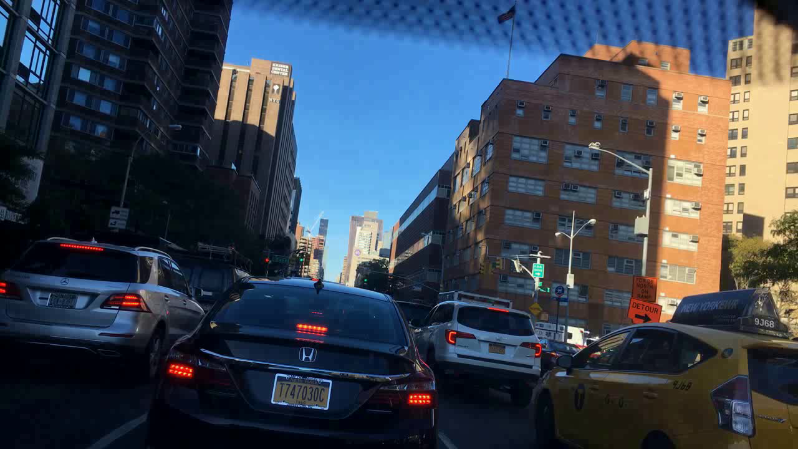
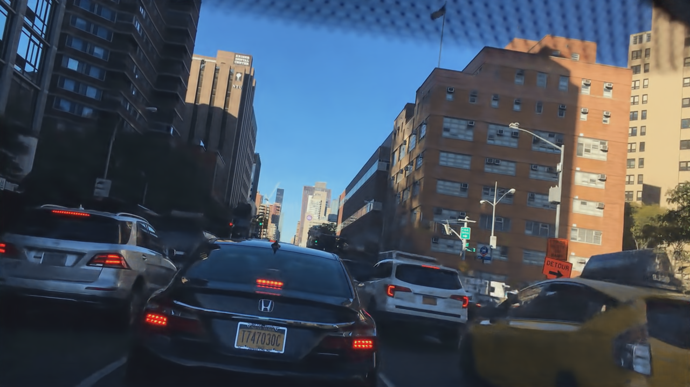

# **EdgeWalker Demo**  

## Introduction
This is a demo implementation of "**EdgeWalker: Diffusion-Enhanced Neural Codec for Semantic Streaming at Edge**".
The demo follows the **compression-and-restoration** pipeline to show the basic usage of EdgeWalker.

## Requirements  
* Anaconda
* Python 3.12
* PyTorch 2.5
* CUDA 11.8


## Directory

The `edgewalker-demo` is the root and its structure is described as below.

```
edgewalker-demo
|-- README.md
|-- environment.yml
|-- encoder.py
|-- decoder.py
|-- model
|-- common
|-- data
|-- output
|-- visualization
```

* `environment.yml` contains to the dependencies to create a Conda environment called `edgewalker`.
* `encoder.py` and `decoder.py` are the two basic scripts to call video compression and restoration, respectively.
* `model` contains pre-trained models.
* `common` contains kernel codes for implementation.
* `data` contains the original video (`./data/original.mp4`).
* `output` saves the compressed video (`./output/compressed.mp4`) and restored video (`./output/restored.mp4`), which are generated by `encoder.py` and `decoder.py`, respectively. The folder `output` will be automatically generated after running the demo.
* `visualization` contains the expected demo results.


## Running the Demo
The whole video compression-restoration pipeline contains three major steps: (1) Create the Conda Environment, (2) Encoder for Video Compression, and (3) Decoder for Video Restoration.

##### (1) Create the Conda Environment

```
cd edgewalker-demo
```
```
conda env create -f ./environment.yml
```
```
conda activate edgewalker
```


##### (2) Encoder for Video Compression

```
python ./encoder.py --load ./data/original.mp4 --save ./output/compressed.mp4
```  
The compressed video will be saved as `./output/compressed.mp4`.


##### (3) Decoder for Video Restoration

```
python ./decoder.py --load ./output/compressed.mp4 --save ./output/restored.mp4
```  
The restored video will be saved as `./output/restored.mp4`.


                                        
## Visualization of Demo Results

Here is the visualization of the demo results, showing the orginal, compressed and restored videos.

* **Orignal video:** `./visualization/original.mp4`  
It is directly encoded with the raw frames (1280x720, RGB 24bit color space, MPEG-4, duration: 6s) from the BDD100K video dataset. The size is about **4.3MB**.

<video width="640" height="360" controls>
  <source src="./visualization/original.mp4" type="video/mp4">
  Your browser does not support the video tag.
</video>




* **Compressed video:**  `./visualization/compressed.mp4`  
EdgeWalker's encoder conducts **semantic-bitwidth-resolution compression** on the BDD100K raw frames, and then saves the semantic features (160x90, 4bit color space with 3 semantic channels, MPEG-4, duration: 6s) in the PNG format for video encoding. The size is about **323KB**.

<video width="640" height="360" controls>
  <source src="./visualization/compressed.mp4" type="video/mp4">
  Your browser does not support the video tag.
</video>


* **Restored video:**  `./visualization/restored.mp4`  
EdgeWalker's decoder conducts the inverse process, i.e., **resolution-bitwidth-semantic restoration**, on the compressed frames and finally obtains the restored frames (1280x720, RGB 24bit color space, MPEG-4, duration: 6s) for video encoding. The size is about **6.1MB**.

<video width="640" height="360" controls>
  <source src="./visualization/restored.mp4" type="video/mp4">
  Your browser does not support the video tag.
</video>


